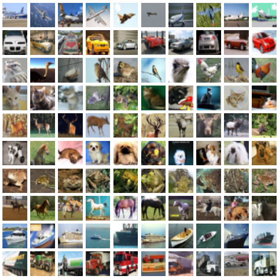

# Autoencoder CIFAR10

**Author:** [Miquel Florensa](https://www.linkedin.com/in/miquel-florensa/)  
**Date:** 2023/05/05  
**Description:** This example shows how to train an autoencoder to reconstruct the CIFAR10 images.

<a href="https://github.com/miquelflorensa/miquelflorensa.github.io/blob/main/code/cifar10_autoencoder_runner.py" class="github-link">
  <div class="github-icon-container">
    
  </div>
  <div class="github-text-container">
    Github Source code
  </div>
</a>

---

## 1. Setup

We first import the required modules: the numpy library, the ImageViz, the autoencoder, the data loader and the encoder/decoder classes.

```python
import numpy as np
from visualizer import ImageViz

from python_examples.autoencoder import Autoencoder
from python_examples.data_loader import MnistDataloader
from python_examples.model import MnistDecoder, MnistEncoder
```

?>Notice that this modules are described [here](modules/modules.md) and the source code is in the *python_examples* directory, in case you have the modules in another directory you must change this paths.

## 2. Prepare the data

We define the number of epochs, some model properties and the paths to the data. Notice that the data is in ubyte format and divided in four files: the training images, the training labels, the test images and the test labels.

```python
# User-input
num_epochs = 10                       # row for 10 epochs
mu = np.array([0.1309,0.1309,0.1309]) # mean of each input
sigma = np.array([1,1,1])             # standard deviation of each input
img_size = np.array([3, 32, 32])      # size of image input
x_train_file = "./data/cifar10/x_train.csv"
y_train_file = "./data/cifar10/y_train.csv"
x_test_file =  "./data/cifar10/x_test.csv"
y_test_file =  "./data/cifar10/y_test.csv"
```

**You can find the used data in the [CIFAR10 dataset](https://www.cs.toronto.edu/~kriz/cifar.html) website.*
## 3. Create the model

In this example we will create a model consisting in an encoder and a decoder that will allow us to reconstruct the original images from the CIFAR10 dataset. Find out more about the architecture in [Analytically Tractable Inference in Deep Neural Networks](https://arxiv.org/pdf/2103.05461.pdf).

```python
class CifarEncoder(NetProp):
    """Encoder network for Cifar10 example"""

    def __init__(self) -> None:
        super().__init__()
        self.layers: list = [2, 2, 6, 4, 2, 6, 4, 1, 1]
        self.nodes: list = [3072, 0, 0, 0, 0, 0, 0, 100, 10]
        self.kernels: list = [3, 1, 3, 3, 1, 3, 1, 1, 1]
        self.strides: list = [1, 0, 2, 1, 0, 2, 0, 0, 0]
        self.widths: list = [28, 0, 0, 0, 0, 0, 0, 0, 0]
        self.heights: list = [28, 0, 0, 0, 0, 0, 0, 0, 0]
        self.filters: list = [3, 16, 16, 16, 32, 32, 32, 1, 1]
        self.pads: list = [1, 0, 1, 1, 0, 1, 0, 0, 0]
        self.pad_types: list = [1, 0, 2, 1, 0, 2, 0, 0, 0]
        self.activations: list = [0, 4, 0, 0, 4, 0, 0, 4, 0]
        self.batch_size: int = 10
        self.is_output_ud: bool = False
        self.init_method: str = "He"
        self.device: str = "cuda"


class CifarDecoder(NetProp):
    """Decoder network for Cifar10 example"""

    def __init__(self) -> None:
        super().__init__()
        self.layers: list = [1, 1, 21, 21, 21]
        self.nodes: list = [10, 1568, 0, 0, 3072]
        self.kernels: list = [1, 3, 3, 3, 1]
        self.strides: list = [0, 2, 2, 1, 0]
        self.widths: list = [0, 7, 0, 0, 0]
        self.heights: list = [0, 7, 0, 0, 0]
        self.filters: list = [1, 32, 32, 16, 3]
        self.pads: list = [0, 1, 1, 1, 0]
        self.pad_types: list = [0, 2, 2, 1, 0]
        self.activations: list = [0, 4, 4, 4, 0]
        self.batch_size: int = 10
        self.sigma_v: float = 8
        self.sigma_v_min: float = 2
        self.is_idx_ud: bool = False
        self.last_backward_layer: int = 0
        self.decay_factor_sigma_v: float = 0.95
        self.init_method: str = "He"
        self.device: str = "cuda"

```

```python
# Model
encoder_prop = CifarEncoder()
decoder_prop = CifarDecoder()
```

## 4. Load the data

The next step is to load the data. We will use the [ClassificationDataloader class](modules/data-loader?id=data-loader) to load the data from a csv and we will pass the batch size and the data paths to the class.

```python
# Data loader
ae_data_loader = ClassificationDataloader(batch_size=encoder_prop.batch_size)
data_loader = ae_data_loader.process_data(x_train_file=x_train_file,
                                          y_train_file=y_train_file,
                                          x_test_file=x_test_file,
                                          y_test_file=y_test_file)
```

## 5. Create visualizer

In order to visualize the reconstruction of the images we can use the PredictionViz class.

```python
# Visualization
viz = ImageViz(task_name="autoencoder",
               data_name="cifar",
               mu=mu,
               sigma=sigma,
               img_size=img_size)
```

> Learn more about  PredictionViz class [here](https://github.com/lhnguyen102/cuTAGI/blob/main/visualizer.py).

## 6. Create the autoencoder object

Once we processed the data, we can create the autoencoder object. We will pass the number of epochs, the data loader, the network properties and vizualization object to the class.

```python
# Train and test
ae_task = Autoencoder(num_epochs=num_epochs,
                        data_loader=data_loader,
                        encoder_prop=encoder_prop,
                        decoder_prop=decoder_prop,
                        viz=viz)
```

> Find out more about the [Autoencoder class](modules/autoencoder.md).

## 7 Train and evaluate the model

Finally, we can train and evaluate the model. We will call the train and predict methods of the autoencoder object.

```python
ae_task.train()
ae_task.predict()
```

## 8. Results

If we created the visualizer object, we can visualize the results. The following figure shows the reconstructed images.


