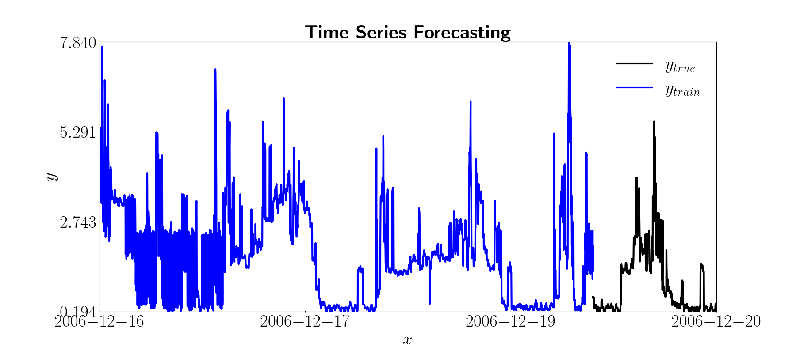
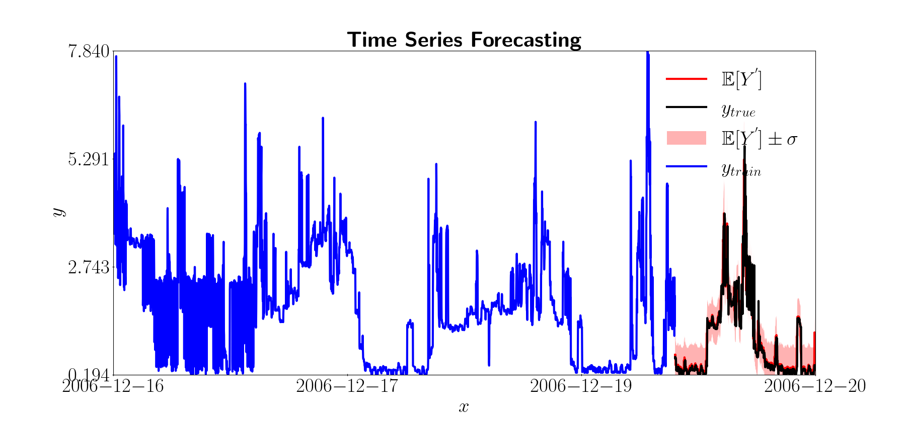

# Electricity time series problem

**Author:** [Miquel Florensa](https://www.linkedin.com/in/miquel-florensa/)  
**Date:** 2023/05/25  
**Description:** This example shows how to use the time series forecaster to solve a forecasting LSTM problem to predict electricity consumptions.  

<a href="https://github.com/miquelflorensa/miquelflorensa.github.io/blob/main/code/electricity_time_series_runner.py" class="github-link">
  <div class="github-icon-container">
    
  </div>
  <div class="github-text-container">
    Github Source code
  </div>
</a>

---

## 1. Setup

```python
from visualizer import PredictionViz

from python_examples.data_loader import TimeSeriesDataloader
from python_examples.model import TimeSeriesLSTM
from python_examples.time_series_forecaster import TimeSeriesForecaster
from pytagi  import load_param_from_files
```

?>Notice that this modules are described [here](modules/modules.md) and the source code is in the *python_examples* directory, in case you have the modules in another directory you must change this paths.

## 2. Prepare the data

In this simple example we will use the individual household electric power consumption data set. The goal is to learn to predict the following timesteps knowing the previous ones.

```python
# User-input
num_epochs = 50       # row for 50 epochs
output_col = [0]      # column to predict
num_features = 1      # number of features
input_seq_len = 5     # input sequence length
output_seq_len = 1    # output sequence length
seq_stride = 1        # stride between input sequences
x_train_file =        "./data/UCI/Electricity/x_train_file.csv"
datetime_train_file = "./data/UCI/Electricity/datetime_train_file.csv"
x_test_file =         "./data/UCI/Electricity/x_test_file.csv"
datetime_test_file =  "./data/UCI/Electricity/datetime_test_file.csv"
```

**You can find the used data in the [UCI webpage](http://archive.ics.uci.edu/ml/datasets/Individual+household+electric+power+consumption).*

?>We can plot the training data points and the trend line we want to learn.



## 3. Create the model

We will use a with a simple LSTM architecture as defined in the TimeSeriesLSTM class wich is suited for Time Series Forecasting. Find out more about the [TimeSeriesLSTM class](modules/models?id=lstm-for-time-series-forecasting).

```python
# Model
net_prop = TimeSeriesLSTM(input_seq_len=input_seq_len,
                          output_seq_len=output_seq_len,
                          seq_stride=seq_stride)
```

> If you want to use a different model, you can create your own class and make sure that it inherits from the NetProp class, more information in [models page](modules/models?id=netprop-class).

## 4. Load the data

We will make use of the [TimeSeriesDataloader](modules/data-loader?id=data-loader) class to load and process the data. The *process_data* function requires the input and output test and training files in a **csv** format.

```python
# Data loader
ts_data_loader = TimeSeriesDataloader(batch_size=net_prop.batch_size,
                                      output_col=output_col,
                                      input_seq_len=input_seq_len,
                                      output_seq_len=output_seq_len,
                                      num_features=num_features,
                                      stride=seq_stride)
data_loader = ts_data_loader.process_data(
    x_train_file=x_train_file,
    datetime_train_file=datetime_train_file,
    x_test_file=x_test_file,
    datetime_test_file=datetime_test_file)
```

## 5. Create visualizer

In order to visualize the predictions of the regression we can use the PredictionViz class. This class will create a window with the true function, the predicted function and the confidence intervals.

```python
# Visualzier
viz = PredictionViz(task_name="forecasting", data_name="Global active power")
```

> Learn more about PredictionViz class [here](https://github.com/lhnguyen102/cuTAGI/blob/main/visualizer.py).

## 6. Train and evaluate the model

Using the [TimeSeriesForecaster class](modules/time-series-forecaster.md) that makes use of TAGI, we will train and test the model. When doing the prediction we can specify the standard deviation factor to calculate the confidence intervals.

```python
# Train and test
ts_task = TimeSeriesForecaster(num_epochs=num_epochs,
                                data_loader=data_loader,
                                net_prop=net_prop,
                                viz=viz)

ts_task.train()
ts_task.predict()
```

## 7. Visualize the results

At the end of the execution the results will be printed in the console as seen below.

> MSE           :  0.07  
> Log-likelihood: -0.50

?> If you have created the visualizarion object and passed it to the regression object, a new window will pop up with the results.



**The black line is the true function, the red line is the predicted function and the red zone is the confidence intervals.*
