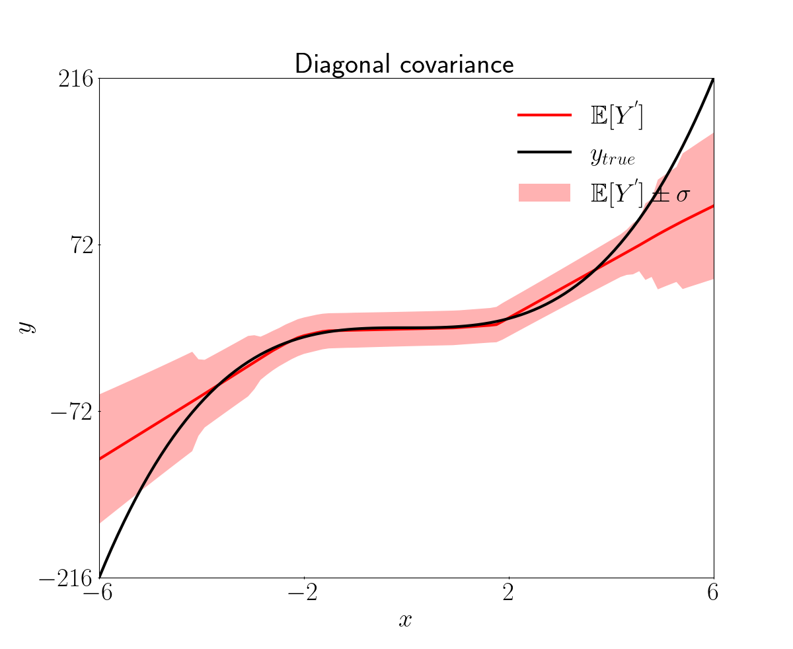

<!-------------------------------------------------------------------
File:         tutorial.md
Description:  FNN tutorial with 1D data
Authors:      Miquel Florensa & Luong-Ha Nguyen & James-A. Goulet
Created:      March 02, 2023
Updated:      March 02, 2023
Contact:      miquelflorensa11@gmail.com & luongha.nguyen@gmail.com & james.goulet@polymtl.ca
Copyright (c) 2023 Miquel Florensa & Luong-Ha Nguyen & James-A. Goulet. Some rights reserved.
-------------------------------------------------------------------->

# 1D toy regression problem

## Introduction

In this tutorial, we will see how to use pytagi to solve a simple regression problem. We will use a 1D toy dataset and a feedforward neural network (FNN) with a simple architecture.

## Define user input and data

In this simple example, we will use a 1D toy dataset. The dataset is composed of 10 training samples and 100 test samples.

```python
# User-input
num_inputs = 1
num_outputs = 1
num_epochs = 50
x_train_file = "./data/toy_example/x_train_1D.csv"
y_train_file = "./data/toy_example/y_train_1D.csv"
x_test_file = "./data/toy_example/x_test_1D.csv"
y_test_file = "./data/toy_example/y_test_1D.csv"
```

## Build Regression Model

We will use a FNN with a simple architecture. We will use the RegressionMLP class explained [here](#regression-mlp-class).

```python
# Model
net_prop = RegressionMLP()                          #MLP model configuration
```

## Data loader

We will use the RegressionDataLoader class explained [here](tutorial_data_loader.md) to load and process the data.

```python
# Data loader
reg_data_loader = RegressionDataLoader(num_inputs=num_inputs,
                                       num_outputs=num_outputs,
                                       batch_size=net_prop.batch_size)
data_loader = reg_data_loader.process_data(x_train_file=x_train_file,
                                           y_train_file=y_train_file,
                                           x_test_file=x_test_file,
                                           y_test_file=y_test_file)
```

## Train and test the model

Using the [regression class](https://github.com/lhnguyen102/cuTAGI/blob/main/python_examples/regression.py) that makes use of TAGI, we will train the model using analytical inference and then and test it.

```python
    # Optional: Visualize the test using visualizer.py
    viz = PredictionViz(task_name="regression", data_name="toy1D")

    # Train and test
    reg_task = Regression(num_epochs=num_epochs,
                          data_loader=data_loader,
                          net_prop=net_prop,
                          viz=viz)
    reg_task.train()                                #Train by infering parameter values
    reg_task.predict(std_factor=3)                  #plot 3σ confidence region 
```

**`PredictionViz` class in [here](https://github.com/lhnguyen102/cuTAGI/blob/main/visualizer.py)*

## Results

The results are shown in the following figure. The black line is the true function, the red line is the predicted function and the red zone is the confidence intervals.

<p align="center">

</p>

## Regression MLP class

The model will have one input layer, one hidden layer and one output layer. The input layer will have a single variable, the hidden layer will have 50 hidden units and the output layer will have one variable. The activation function of the hidden layer will be ReLU and the batch size will be four. The observation noise's standard deviation and its minimum will be 0.06. When one wich to use a scheduler to decrease `sigma_v` over epochs, `sigma_v_min` should be choosen to be smaller than `sigma_v` (Note: this is commonly the case for CNN).

```python
# Model
from pytagi import NetProp

class RegressionMLP(NetProp):
    """Multi-layer perceptron for regression task"""

    def __init__(self) -> None:
        super().__init__()
        self.layers = [1, 1, 1]         # [input layer,  hidden layer,       output layer]
        self.nodes = [1, 50, 1]         # [#inputs,      #hidden units,      #outputs    ]
        self.activations = [0, 4, 0]    # [~,            ReLU activation,    ~           ]
        self.batch_size = 4             # Number of observation per batch
        self.sigma_v = 0.06             # Observation error's standard deviation
        self.sigma_v_min: float = 0.06  # Min. observation error's std for the scheduler
        self.device = "cpu"             # CPU computations
```
